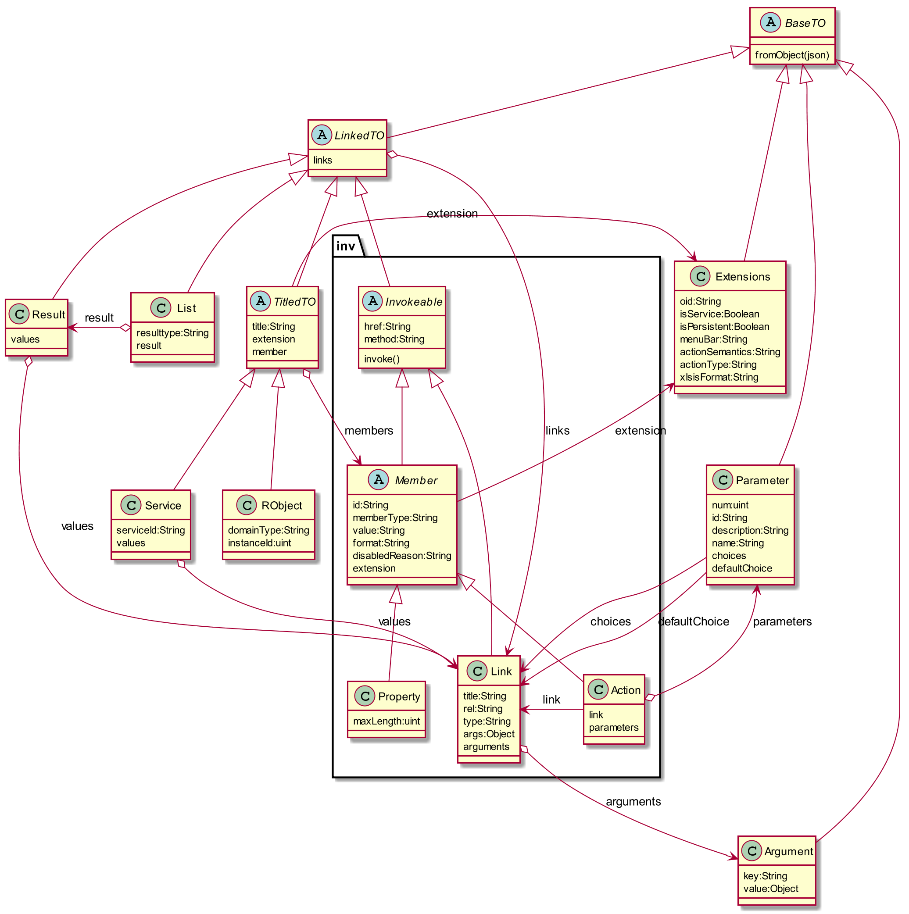

# Tool Chain

* Apache Maven 3.3.9
* Apache Flex 1.16.1
* FlexJS 0.8.0 
* IntelliJ 2017.3 (Ultimate)
* Moz://a FireFox 52 ESR
** RestClient
* Adobe FlashDebugger 30
* Windows 7

## GotChas
* Apache Flex could not be installed with the installer due to a firewall issue. Workaround: manual download and unzip.
* Browser (FF) was only showing a white page, browser debugger indicated: "ReferencError: swfobject is not defined"
In order for index.template.html to open the application, swfobject.js had to be placed in /html-template
see: 
** http://ebanshi.cc/questions/5161462/how-to-integrate-flowplayer-in-extjs-4-1
** https://helpx.adobe.com/flash-player/kb/configure-debugger-version-flash-player.html
** http://www.filehorse.com/download-adobe-flash-player-debugger-firefox/
* "unable to open" "localFonts.ser" => https://intellij-support.jetbrains.com/hc/en-us/community/posts/206164719-IU-90-94-Flex-Problem-with-Flex-Mojos-library-project
=> remove FlexMojo SDK (which always get's reconfigured when IJ starts anew)

* Error:Build configuration 'roViz' (module 'roViz'): Additional compiler configuration file not found: C:\data_jra\workspace-ife\roViz\.idea\flexmojos\roViz-org.ro.viz.xml
=> Project Structure -> Project Settings -> Modules -> roViz -> Compiler Options -> Additional compiler configuration file

* Error: Build Configuration is not specified. Occurred after setting up pom.xml for FlexJs
Solution:  use the old pom.xml

* Error "Invalid version specified, ''"Target player is not set. Copy directory 
(from <mavenrepository>/com/adobe/flash/framework/playerglobal/<version>) 
to <FLEX_SDK>/frameworks/libs/player/<version>. Hereafter it should be possible to select an entry in the dropdownlist, 
eventually after 'invalidate cache and restart'. 
See: https://intellij-support.jetbrains.com/hc/en-us/community/posts/206750345-Flex-plugin-build-configuration-change-target-player-version

* Error "object was null: null" => remove ij $user/temp/**/roviz_* directory.

* No output with trace(): https://github.com/mozilla/shumway/wiki/Trace-Output-with-Flash-Player-Debugger

* complaints about crossdomain.xml: add file to ~\webapp\src\main\webapp see 
https://stackoverflow.com/questions/11035433/do-i-need-a-cross-domain-policy
----
<?xml version="1.0"?>
<!DOCTYPE cross-domain-policy SYSTEM "http://www.adobe.com/xml/dtds/cross-domain-policy.dtd" >
<cross-domain-policy>
	<site-control permitted-cross-domain-policies="all"/> 
	<allow-access-from domain="*" to-ports="*" secure="false"/> 
	<allow-http-request-headers-from domain="*" headers="*" secure="false"/>
</cross-domain-policy>
<!-- This file is not for production because it means no restriction at all !!! -->
----
See also: https://www.google.com/url?sa=t&rct=j&q=&esrc=s&source=web&cd=1&cad=rja&uact=8&ved=2ahUKEwji9smnx4DdAhWPYlAKHUvoALIQFjAAegQIABAC&url=https%3A%2F%2Fwww.owasp.org%2Fimages%2F9%2F9d%2F20140820-Flash_Security_by_Arcus_Security.pdf&usg=AOvVaw01becgI5SiTAeCNpmUGnOc

## Helpful Resources:
* https://stackoverflow.com/questions/5536420/intellij-idea-actionscript-project-cannot-connect-debugger-version-of-flash
* https://intellij-support.jetbrains.com/hc/en-us/community/posts/115000241004-IntelliJ-Flash-Debugger
* http://home.apache.org/~aharui/FlexJSWorldTour/FlexJS%20World%20Tour%20SF.pptx
* http://edutechwiki.unige.ch/en/Flash_datagrid_component_tutorial

## IntelliJ
* Alt-Ctrl-s

* Alt-Ctrl-Shift-S

# Design & Implementation

image::./images/uml-overview.png[Overview]

## Overview

roViz issues XmlHttpRequests asynchronously (multiple in parallel) in order to speed up data transfers.
See: 

image::./images/LogEntries.png[LogEntries]

After selecting a server connection all service urls are invoked in order to build the menu. 
Note the urls with offsets 61..63. After a think time of 1900ms the user invoked
SimpleObjects.listAll, which in turn leads to invoking ~listAll/invoke and retrieving of 3 instances of SimpleObject.

## Packages

### core

### handler
Handlers for HttpResponses. Chain of Responsibility pattern is defined in 'core.Dispatcher'.

### layout
Classes related to layout parsing and view construction.
Instances are created from json in the same way as classes in the to package (fromJson()). 
Views are constructed via build();

image::./images/uml-layout.png[Layout Transfer Objects]

### mx
Views derived from standard classes, usually from mx.*

### to
Transfer Objects - represent JSON structures from responses.

### xhr
XmlHttpRequest and logging utilities

## Why Actionscript?

The Flashplayer is known for many security issues and Adobe probably didn't take complaints seriously.
This together with  https://en.wikipedia.org/wiki/Thoughts_on_Flash[Steve Jobs criticism of Flash] 
made AS less attractive to developers.
As a consequence https://stackoverflow.blog/2017/08/01/flash-dead-technologies-might-next/[the interest in Flash/Flex declined].

On the other hand the AS ecosystem has a long history and it's class library is mature.
Together with Apache Flex and Flex JS there is the possibility to get rid of some of the limitations.

IMO AS is still a valid approach and one should not throw out the baby (AS) with the water (Flash),

[verse, Reinhard Mey, Der Mörder ist immer der Gärtner]
____
Den Freund aller Blumen und Gräser,
verfolgte ein fortschrittlicher Schuft,
der Mann bohrte nur mit dem Laser, 
Löcher in Leute und Luft.

Doch der Gärtner lauert ihm auf in einem Strauch,
und erschlägt ihn mit seinem Gartenschlauch,
und dann schreibt seine Hand in das rinnende Blut,
auch althergebrachte Methoden sind gut.
____

## Are used Classes supported by Apache Flex/Royale?
mx.containers.TitleWindow (/)
mx.events.CloseEvent (Fx3)
mx.managers.PopUpManager;
HTTPService  (FX3)

----
C:\bin\apache-royal-0.9.2\royale-asjs\bin\mxmlc.bat -api-report=api-report.txt -load-config=c:/bin/apache-flex-sdk-4.16.1/frameworks/flex-config.xml src\main\flex\App.mxml
----

Potential limitations and workarounds regarding PUT, DELETE
* https://forums.adobe.com/thread/721464[Gary 2012 on lifting of the limitation and as3httpclientlib]
* https://stackoverflow.com/questions/223312/custom-headers-possible-with-urlrequest-urlstream-using-method-get/695890#695890[hasseg / Chris W. Rea]
* https://cambiatablog.wordpress.com/2010/08/10/287/[X-HTTP-Method-Override 2010]