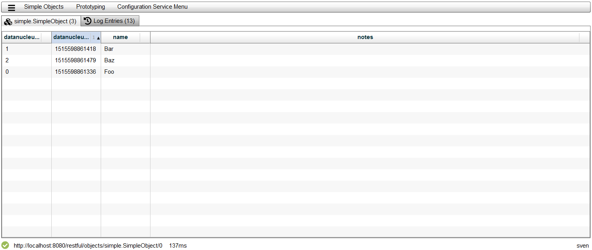
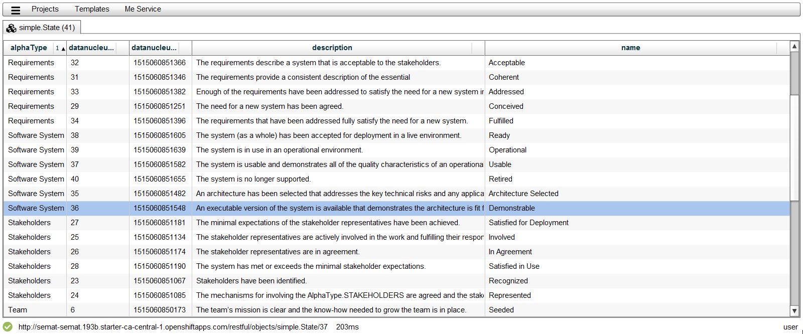

# About

roViz is a viewer for http://www.restfulobjects.org[Restful Objects] written in ActionScript (http://flex.apache.org/[Apache Flex]), 
ie. a generic client for applications that implement the Restful Objects Specification. 
An https://isis.apache.org/[Apache Isis] application with the restful objects interface enabled 
(https://github.com/apache/isis/tree/master/example/application/simpleapp[SimpleApp], https://github.com/isisaddons/isis-app-todoapp[ToDoApp] , etc.) can be used for the server part. 

A http://nakedobjects.net/home/index.shtml[Naked Objects for .NET] application should work as well, but is not tested yet.

## How does it look like?
TIP: After selecting one of the preconfigured applications, the menu gets populated. Actions, here: listAll can be selected and a Tab with a table is displayed:

TIP: Clicking on the StatusBar at the bottom will create another tab showing logged XmlHttpRequests:

image::./images/LogEntries.png[Preview2]

TIP: Remote applications (here: http://semat.ofbizian.com/[SEMAT]) can be used as well, and even mixed with local apps. 

## Where is the Action?
Probably in a PopUpMenu. Press right mouse button.

## Bugs
CAUTION: Newly created Tabs are not focused

CAUTION: Menu items (Actions) are not ordered

CAUTION: LogEntries are not updated automatically

CAUTION: When there are many Menu entries, a horizontal ScrollBar is added at the bottom

CAUTION: Order is not obeyed with Menu entries

## TODO's for the PoC
* 'collapse' tabs into 'dock'
* drag & drop (eg. tab to dock) 
* Use layout / object-layout for menu, tables and tabs 
* Implement PUT, POST, DELETE (alongside GET)
* Load and render single object 
* Transpile to Javascript via Maven using https://cwiki.apache.org/confluence/display/FLEX/FlexJS[FlexJS]
* Implement Filtered Table 

## Next 
* Integrate Calendar View (for ToDo App)
* Fullblown GanttChart (incl. birds eye view)
* Measure code coverage
* Visualize Geolocations eg. with https://wiki.openstreetmap.org/wiki/Halcyon[Halcyon]
* Use http://svn.code.sf.net/adobe/cairngorm/code/[Cairngorm FW] to decouple data loading from rendering
* https://stackoverflow.com/questions/5388290/how-to-display-svg-in-flex/5388543#5388543[SVG limitations and libs]
* FlatSpark skins: do not support Menubar icons right now, see: https://cwiki.apache.org/confluence/display/FLEX/Using+FlatSpark+skins
* Use SQL lite as store for url/credentials
* Visualize DomainModel (reconstruct from DomainObjects, Attributes, etc.)
* Hook up to the internal event bus of the server to have change notifications pushed. Eventually call server for data. See https://github.com/Lightstreamer/Lightstreamer-example-StockList-client-flex#basic-stock-list-demo---flex-client[Lightstreamer]
